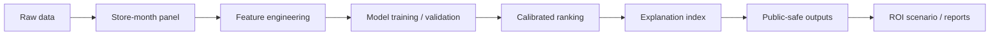

# F&B 매장 성장 스코어링 시스템

> **F&B 매장의 성장 후보군을 우선순위화하는 ML decision-support PoC**  
> 르몽 캡스톤 디자인 과제 · 2026 / F&B 마이크로펀드 × AI 알고리즘 연구개발

GroMong Score는 F&B 매장의 주문·리뷰·운영 신호를 바탕으로 성장 후보군을 우선순위화하고, 주요 신호를 설명용 지수로 정리하는 ML 기반 의사결정 보조 프로젝트입니다.

<p>
  
  
  
  
  
  
  
  
  
</p>

## Overview

그로몽 스코어는 매장별 주문 흐름, 리뷰 변화, 답글 대응, 브랜드/카테고리 맥락, 일부 외부 상권 신호를 결합해 성장 후보군을 정렬합니다.

최종 제출 기준에서는 **predictive ranking은 calibrated model probability**를 사용하고, 기존 composite score는 **explanation_index / signal_decomposition_index**로 분리해 주요 신호 해석에 활용합니다. ROI는 고정 가정 기반의 scenario 분석으로 제공합니다.

## Key Features

| Feature                | Description                                                                    |
| ---------------------- | ------------------------------------------------------------------------------ |
| 성장 후보군 우선순위화 | `predictive_rank_score`와 `predicted_priority_rank`로 매장 검토 순위 제공      |
| 설명 지수 분해         | 주문, 리뷰, 운영, 안정성, 상권 신호를 `explanation_index`로 요약               |
| 리뷰·답글 NLP feature  | 리뷰 길이, 감성 hit, 답글 길이, 쿠폰/템플릿 신호 등 사전 기반 feature 생성     |
| 검증 및 방향성 점검    | time split, group holdout, calibration, Top-K/lift, score direction audit 수행 |
| 제출용 artifact gate   | public output에서 label/future/treatment 계열 컬럼 노출 여부 점검              |

## Tech Stack

| Layer             | Stack                                             |
| ----------------- | ------------------------------------------------- |
| Language          | Python                                            |
| Data Processing   | pandas, NumPy                                     |
| Visualization     | matplotlib                                        |
| Modeling Pipeline | CSV-based feature engineering and scoring scripts |
| Demo              | Python standard library HTTP server               |
| Outputs           | CSV, Markdown, SVG/PNG                            |

## Pipeline



## Repository Structure

```text
.
+-- src/                 # analysis, modeling, scoring, demo scripts
+-- docs/                # methodology and project documents
+-- analysis_outputs/    # generated reports and final artifacts
+-- data/                # ignored raw data
+-- external_data/       # ignored external data
+-- README.md
```

## Core Modules

| Path                                 | Role                                              |
| ------------------------------------ | ------------------------------------------------- |
| `src/build_scores.py`                | score component와 내부 scoring table 생성         |
| `src/run_modeling.py`                | 성장 후보군 분류 모델 학습 및 검증                |
| `src/run_review_nlp.py`              | 리뷰/답글 기반 NLP feature 생성                   |
| `src/run_seoul_external_modeling.py` | 서울 subset 외부 상권 feature 결합 및 방향성 점검 |
| `src/run_roi_simulation.py`          | ROI scenario 분석 및 Top-K ROI 요약 생성          |
| `src/run_weight_sensitivity.py`      | score weight sensitivity 분석                     |
| `src/run_score_direction_audit.py`   | component direction audit 및 ranking 기준 재정의  |
| `src/finalize_public_artifacts.py`   | public-safe output 생성 및 artifact gate 실행     |
| `src/app.py`                         | 로컬 데모 서버                                    |

## Outputs

| Type   | File                                                     | Description                   |
| ------ | -------------------------------------------------------- | ----------------------------- |
| Public | `analysis_outputs/scoring/latest_shop_scores_public.csv` | 전체 매장 priority ranking    |
| Public | `analysis_outputs/scoring/store_ranking_topN.csv`        | Top-N 후보군 ranking          |
| Report | `analysis_outputs/final_model_card.md`                   | 모델 사용 범위와 해석 기준    |
| Report | `analysis_outputs/final_freeze_manifest.json`            | 최종 artifact freeze 정보     |
| Report | `analysis_outputs/final_public_artifact_gate_report.md`  | public output 컬럼 검증 결과  |
| Report | `analysis_outputs/final_gap_closure_report.md`           | 피드백 반영 및 남은 한계 정리 |

세부 제출/backup/제외 파일 목록은 `analysis_outputs/final_submission_manifest.md`에서 확인할 수 있습니다.

## Validation Summary

검증은 후보군 ranking과 해석 가능성을 확인하는 방향으로 구성했습니다.

- time-aware split 기반 모델 검증
- store-level group holdout 검증
- calibration 및 Brier score 확인
- PR-AUC, Top-K hit, Top-K lift 기반 ranking 검토
- score component direction audit
- public artifact gate를 통한 제출용 컬럼 검증

상세 수치와 해석은 `analysis_outputs/final_model_card.md`, `analysis_outputs/scoring/ranking_strategy_summary.md`, `analysis_outputs/modeling/model_validation_audit.csv`를 참고합니다.

## How to Run

```bash
python -m venv .venv
.venv\Scripts\pip install -r requirements.txt
```

```bash
.venv\Scripts\python src/build_store_month_panel.py
.venv\Scripts\python src/run_review_nlp.py
.venv\Scripts\python src/run_modeling.py
.venv\Scripts\python src/run_seoul_external_modeling.py
.venv\Scripts\python src/build_scores.py
.venv\Scripts\python src/run_roi_simulation.py
.venv\Scripts\python src/run_score_direction_audit.py
.venv\Scripts\python src/finalize_public_artifacts.py
```

Demo:

```bash
.venv\Scripts\python src/app.py
```

```text
http://127.0.0.1:8765
```

## Notes

- `predictive_rank_score`는 calibrated model probability입니다.
- `decision_band`는 자동 결정이 아니라 priority review band입니다.
- `explanation_index`는 예측 순위 기준이 아니라 신호 해석용 지수입니다.
- ROI는 scenario-based decision support로 해석합니다.
- 본 프로젝트는 capstone PoC입니다.
