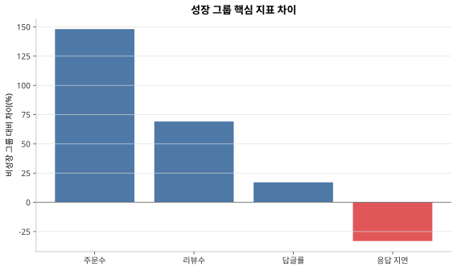
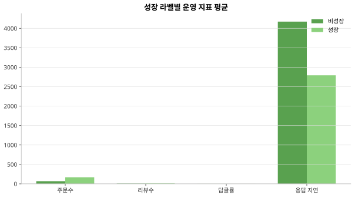
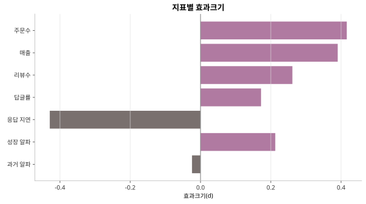
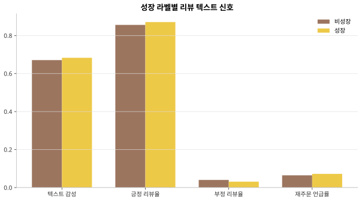
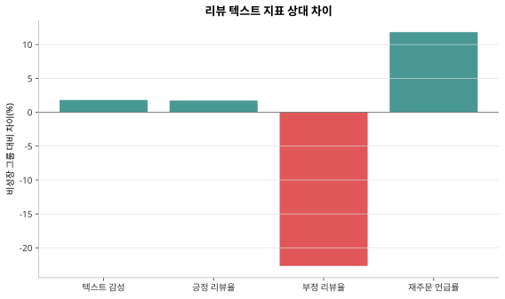
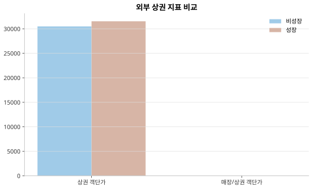
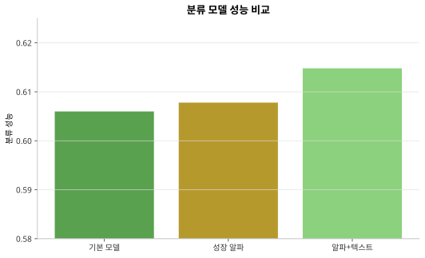
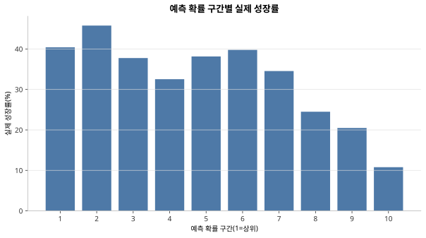
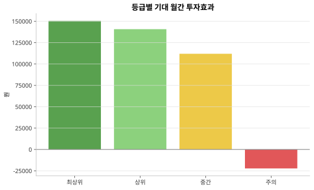
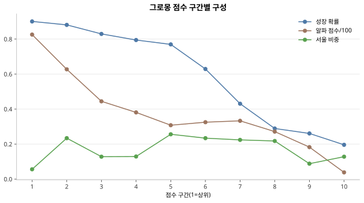

# 피드백 반영 및 추가 EDA 보고서

## 1. 개요

본 보고서는 기존 분석 결과에 대해 제시된 피드백을 반영하여 수행한 추가 분석과 코드 보완 내용을 정리한 문서이다. 기존 프로젝트는 매장 내부 운영 데이터, 리뷰 데이터, 성장 라벨, 인과추론 결과를 활용하여 성장 유망 매장을 선별하는 구조를 갖고 있었다. 그러나 피드백에서는 다음과 같은 보완 필요성이 제기되었다.

첫째, 인과추론 결과가 강조되어 있으나 실제 과제의 목적은 개별 매장의 성장 가능성을 분류하고 우선순위를 정하는 데 더 가깝다. 둘째, 리뷰 수와 별점뿐 아니라 리뷰 텍스트 자체에서 추가 정보를 추출할 필요가 있다. 셋째, 매장 내부 신호 중심의 분석에서 벗어나 외부 상권 환경을 고려할 필요가 있다. 넷째, 예측 결과가 실제 투자효과 또는 운영 의사결정으로 어떻게 연결되는지에 대한 설명이 부족하다.

이에 따라 본 보완 작업에서는 분석 방향을 성장 유망 매장 분류 중심으로 재정렬하고, 리뷰 텍스트 피처, 외부 상권 변수, 투자효과 시뮬레이션을 추가하였다. 또한 EDA 결과를 별도 산출물로 정리하여 각 보완 내용이 데이터상에서 어떤 근거를 갖는지 확인하였다.

## 2. 피드백 반영 내역

| 피드백 항목 | 기존 분석의 한계 | 보완 내용 | 보고서 내 근거 | 상태 |
| --- | --- | --- | --- | --- |
| 모델 선택 근거가 체계적이라는 점은 강점 | 모델 비교 결과가 최종 스코어와 충분히 연결되지 않음 | 기본 모델, 성장 알파 모델, 알파+텍스트 모델을 동일한 시간 기준 분할로 비교하고 최종 스코어에서 알파+텍스트 예측을 우선 사용 | 4.4절에서 세 모델의 분류 성능, F1, 상위 후보 정확도를 비교하고, 예측 확률 구간별 실제 성장률을 검증하였다. | 완료 |
| 리뷰 텍스트에서 더 깊은 정보를 추출할 필요 | 리뷰 수, 별점, 답글률 중심으로 텍스트 내용 반영이 제한적 | 리뷰 원문에서 감성, 긍정/부정 비율, 맛/배달/서비스/재주문 관련 신호를 추출해 모델 입력에 통합 | 4.2절에서 텍스트 감성, 부정 리뷰율, 재주문 언급률의 성장/비성장 차이를 제시하였다. | 완료 |
| 외부 상권 변수가 약함 | 매장 내부 운영 지표 중심으로 성장 원인을 설명 | 서울 211개 매장에 대해 상권 매출, 상권 주문수, 상권 객단가, 매장/상권 객단가 비율을 결합하여 분석 | 4.3절에서 외부 상권 지표를 성장 라벨별로 비교하고, 단독 지표가 아닌 상권 맥락 변수로 해석하였다. | 완료, 확장 필요 |
| DID/PSM/Event Study보다 분류에 집중할 필요 | 인과추론 결과가 프로젝트 중심처럼 보일 수 있음 | 인과추론은 평균 효과 검증의 보조 근거로 두고, 최종 의사결정은 성장 라벨 분류와 상위 추천 성능 중심으로 재정렬 | 4.4절에서 분류 모델의 성능과 ranking lift를 검증하여 개별 매장 우선순위화 가능성을 확인하였다. | 완료 |
| 예측과 투자효과가 분리되어 있음 | 성장 확률이 투자 우선순위로 어떻게 연결되는지 설명 부족 | 성장 확률 기반 기대 추가 주문, 기대 마진, 기대 월간 투자효과를 계산하는 시뮬레이션 추가 | 4.5절에서 등급별 기대 투자효과와 투자효과 양수 비율을 제시하였다. | 완료 |

## 3. 추가 EDA 방법

추가 EDA는 피드백에서 지적된 사항을 검증하기 위해 다음 네 가지 방향으로 수행하였다.

첫째, 성장 그룹과 비성장 그룹이 실제 운영 지표에서 구분되는지 확인하였다. 이를 위해 주문수, 매출, 리뷰수, 답글률, 응답 지연, 성장 알파의 평균 차이와 상대 차이를 계산하였다. 단순 평균 차이만으로는 두 집단의 분리 정도를 판단하기 어렵기 때문에 Cohen의 d를 함께 산출하였다.

둘째, 리뷰 텍스트에서 추출한 감성 및 주제 지표가 성장 그룹과 비성장 그룹에서 어떤 차이를 보이는지 확인하였다. 사용한 지표는 텍스트 감성, 긍정 리뷰율, 부정 리뷰율, 배달 언급률, 재주문 언급률이다.

셋째, 외부 상권 변수가 성장 라벨과 어떤 관계를 갖는지 확인하였다. 현재 외부 데이터는 서울 매장 211개에 한정되어 있으므로, 해당 subset에서 상권 매출, 상권 주문수, 상권 평균 객단가, 매장/상권 객단가 비율을 비교하였다.

넷째, 보완된 분류 모델이 실제로 후보군 우선순위화에 유의미한지 확인하였다. 이를 위해 모델별 분류 성능을 비교하고, 예측 확률을 10개 구간으로 나눈 뒤 각 구간의 실제 성장률을 계산하였다. 또한 최종 점수 등급이 기대 투자효과와 연결되는지 확인하기 위해 등급별 기대 월간 투자효과를 산출하였다.

## 4. EDA 결과

### 4.1 성장/비성장 그룹의 운영 지표 차이

성장 그룹은 비성장 그룹 대비 주문수, 매출, 리뷰수, 답글률에서 더 높은 값을 보였다. 평균 응답 지연은 성장 그룹에서 더 낮았다.

| 지표 | 비성장 평균 | 성장 평균 | 차이 | 상대 차이 | 효과크기 |
| --- | ---: | ---: | ---: | ---: | ---: |
| 주문수 | 68.1782 | 169.1733 | 100.9950 | +148.13% | 0.4162 |
| 매출 | 1,834,187 | 4,377,257 | 2,543,070 | +138.65% | 0.3904 |
| 리뷰수 | 8.8084 | 14.8969 | 6.0885 | +69.12% | 0.2614 |
| 답글률 | 0.4702 | 0.5505 | 0.0803 | +17.09% | 0.1722 |
| 평균 응답 지연 | 4,172.9013 | 2,791.9322 | -1,380.9691 | -33.09% | -0.4290 |
| 결과 설명용 성장 알파 | -1.2651 | 2.9508 | 4.2158 | 방향성 뚜렷 | 0.2127 |

주문수의 효과크기는 0.4162, 매출의 효과크기는 0.3904로 나타났다. 이는 성장 그룹과 비성장 그룹이 단순히 라벨상으로만 구분되는 것이 아니라 실제 운영 지표에서도 일정 수준 이상 분리된다는 점을 보여준다. 리뷰수와 답글률의 효과크기는 상대적으로 작지만, 성장 그룹에서 일관되게 높은 방향성을 보였다.

응답 지연은 성장 그룹에서 더 낮게 나타났다. 이는 고객 대응 속도가 운영 품질 지표로 활용될 가능성을 시사한다. 다만 이 결과만으로 응답 속도가 성장의 원인이라고 단정할 수는 없으며, 분류 모델에서는 운영 신호 중 하나로 해석하는 것이 타당하다.

### 4.2 리뷰 텍스트 지표 분석

리뷰 텍스트 지표에서는 성장 그룹과 비성장 그룹의 차이가 운영 지표만큼 크지는 않았다. 그러나 방향성 있는 차이는 확인되었다.

| 텍스트 지표 | 비성장 평균 | 성장 평균 | 차이 | 상대 차이 |
| --- | ---: | ---: | ---: | ---: |
| 텍스트 감성 | 0.6709 | 0.6831 | 0.0122 | +1.81% |
| 긍정 리뷰율 | 0.8562 | 0.8710 | 0.0148 | +1.73% |
| 부정 리뷰율 | 0.0400 | 0.0310 | -0.0091 | -22.67% |
| 배달 언급률 | 0.1499 | 0.1564 | 0.0065 | +4.33% |
| 재주문 언급률 | 0.0644 | 0.0720 | 0.0076 | +11.83% |

성장 그룹은 비성장 그룹보다 평균 텍스트 감성과 긍정 리뷰율이 소폭 높았다. 부정 리뷰율은 성장 그룹에서 22.67% 낮았고, 재주문 언급률은 11.83% 높았다. 이는 리뷰 텍스트가 단독으로 성장 여부를 강하게 설명한다고 보기는 어렵지만, 기존의 리뷰 수와 별점 중심 분석을 보완하는 추가 신호로 활용될 수 있음을 의미한다.

따라서 리뷰 텍스트 피처를 분류 모델에 통합한 것은 피드백에서 제기된 “텍스트 자체에서 더 깊은 정보를 끌어내는 모델링” 요구에 대한 직접적인 보완으로 볼 수 있다.

### 4.3 외부 상권 변수 분석

외부 상권 데이터는 서울 매장 211개에 대해 결합되었다. 성장 그룹이 속한 상권은 비성장 그룹보다 상권 매출과 상권 주문수가 높았다.

| 외부 상권 지표 | 비성장 평균 | 성장 평균 | 차이 | 상대 차이 |
| --- | ---: | ---: | ---: | ---: |
| 상권 4분기 매출 | 106,285,599,450 | 135,621,680,547 | 29,336,081,096 | +27.60% |
| 상권 4분기 주문수 | 3,243,684 | 4,050,904 | 807,220 | +24.89% |
| 상권 평균 객단가 | 30,493.7338 | 31,537.6868 | 1,043.9530 | +3.42% |
| 매장/상권 객단가 비율 | 0.9230 | 0.8628 | -0.0602 | -6.52% |

상권 규모 지표인 매출과 주문수는 성장 그룹에서 더 높았다. 그러나 매장/상권 객단가 비율은 성장 그룹에서 더 낮았다. 이 결과는 외부 상권 변수가 성장 여부를 단독으로 설명하는 지표라기보다, 매장이 놓인 외부 환경과 가격 포지션을 해석하는 맥락 변수임을 보여준다.

따라서 외부 상권 변수는 최종 모델에서 내부 운영 지표를 대체하기보다는, 유사한 내부 성과를 보이는 매장들이 왜 다르게 성장하는지 설명하는 보조 변수로 사용하는 것이 적절하다.

### 4.4 분류 모델 성능 분석

피드백 반영 후 모델링의 중심은 성장 유망 매장 분류로 재정렬되었다. 비교 대상은 기본 모델, 성장 알파 모델, 알파+텍스트 모델이다.

| 모델 | 분류 성능 | F1 | 상위 100 정확도 | 기본 모델 대비 개선폭 |
| --- | ---: | ---: | ---: | ---: |
| 기본 모델 | 0.6060 | 0.5173 | 0.4000 | 0.0000 |
| 성장 알파 모델 | 0.6078 | 0.5169 | 0.4200 | 0.0018 |
| 알파+텍스트 모델 | 0.6148 | 0.5250 | 0.4000 | 0.0088 |

알파+텍스트 모델은 세 모델 중 가장 높은 분류 성능을 보였다. 성장 알파 단독 모델보다 리뷰 텍스트 피처를 결합했을 때 성능이 개선되었다. 이는 텍스트 피처가 독립적인 강한 신호라기보다는, 기존 운영 및 성장 신호에 추가적인 설명력을 제공한다는 의미로 해석할 수 있다.

예측 확률 구간별 실제 성장률은 다음과 같다.

| 예측 확률 구간 | 평균 예측 확률 | 실제 성장률 | 전체 대비 lift |
| ---: | ---: | ---: | ---: |
| 1구간 | 0.9728 | 40.40% | 1.2445 |
| 2구간 | 0.9208 | 45.78% | 1.4103 |
| 3구간 | 0.8630 | 37.75% | 1.1629 |
| 8구간 | 0.2877 | 24.50% | 0.7546 |
| 9구간 | 0.1733 | 20.48% | 0.6309 |
| 10구간 | 0.0787 | 10.80% | 0.3327 |

상위 예측 구간의 실제 성장률은 하위 구간보다 높았다. 특히 최상위 구간의 실제 성장률은 40.40%, 최하위 구간은 10.80%로 차이가 컸다. 이는 모델이 단순히 평균적인 성장 확률을 예측하는 데 그치지 않고, 우선 검토 후보군을 선별하는 ranking 도구로도 활용 가능함을 보여준다.

### 4.5 점수 등급과 투자효과 분석

예측 결과를 실제 의사결정에 연결하기 위해 등급별 기대 월간 투자효과를 계산하였다. 계산은 기본 투자효과 시나리오를 기준으로 하였다.

| 등급 | 매장 수 | 평균 성장 확률 | 평균 기대 월간 투자효과 | 중앙값 기대 투자효과 | 투자효과 양수 매장 | 투자효과 양수 비율 |
| --- | ---: | ---: | ---: | ---: | ---: | ---: |
| A | 87 | 0.9014 | 150,409 | 157,530 | 87 | 100.00% |
| B | 236 | 0.8692 | 140,749 | 146,666 | 235 | 99.58% |
| C | 359 | 0.7733 | 111,981 | 119,902 | 348 | 96.94% |
| D | 564 | 0.3260 | -22,198 | -28,717 | 174 | 30.85% |

A, B, C 등급은 평균 기대 투자효과가 양수였고, 투자효과 양수 매장 비율도 높았다. 반면 D등급은 평균 기대 투자효과가 음수였고, 투자효과 양수 비율도 30.85%에 그쳤다. 이 결과는 GroMong Score가 단순한 설명 점수가 아니라 투자 또는 운영 지원 후보군을 좁히는 의사결정 도구로 사용될 수 있음을 보여준다.

### 4.6 최종 점수 구간별 profile

최종 점수 구간별로 평균 성장 확률, 평균 알파 점수, 서울 외부데이터 비중을 비교하였다.

| 점수 구간 | 매장 수 | 평균 점수 | 평균 성장 확률 | 평균 알파 점수 | 서울 외부데이터 비중 |
| ---: | ---: | ---: | ---: | ---: | ---: |
| 1구간 | 125 | 83.1186 | 0.9008 | 82.5748 | 0.0560 |
| 2구간 | 124 | 73.1782 | 0.8811 | 62.7251 | 0.2339 |
| 3구간 | 125 | 65.7529 | 0.8295 | 44.4363 | 0.1280 |
| 8구간 | 124 | 38.3983 | 0.2890 | 27.1297 | 0.2177 |
| 9구간 | 125 | 35.1638 | 0.2608 | 18.2675 | 0.0880 |
| 10구간 | 125 | 26.2130 | 0.1958 | 3.8317 | 0.1280 |

상위 점수 구간은 평균 성장 확률과 평균 알파 점수가 모두 높았다. 하위 점수 구간은 두 지표가 모두 낮았다. 서울 외부데이터 비중은 점수 구간과 일관된 단조 관계를 보이지 않았다. 이는 외부데이터가 점수를 지배하는 변수가 아니라 일부 매장에 대해 상권 맥락을 보완하는 역할을 하고 있음을 의미한다.

## 5. 종합 해석

추가 EDA와 코드 보완 결과, 기존 분석은 다음과 같이 보완되었다.

첫째, 성장 라벨은 실제 운영 지표와 일정한 관련성을 갖는다. 성장 그룹은 주문수, 매출, 리뷰수, 답글률에서 비성장 그룹보다 높았고, 응답 지연은 낮았다. 이는 성장 유망 매장 분류 모델이 무작위 라벨이 아니라 운영 성과 차이를 반영한 라벨을 학습하고 있음을 보여준다.

둘째, 리뷰 텍스트는 기존 리뷰 수와 별점 지표를 보완하는 신호로 활용 가능하다. 텍스트 감성, 부정 리뷰율, 재주문 언급률에서 성장 그룹과 비성장 그룹의 방향성 있는 차이가 확인되었다. 알파+텍스트 모델이 가장 높은 분류 성능을 보인 것도 이 해석을 뒷받침한다.

셋째, 외부 상권 변수는 성장 여부를 단독으로 설명하는 결정적 변수는 아니지만, 매장이 위치한 환경을 설명하는 맥락 변수로 의미가 있다. 특히 상권 매출과 상권 주문수는 성장 그룹에서 더 높게 나타났다. 다만 매장/상권 객단가 비율은 성장 그룹에서 낮게 나타나므로, 외부 변수는 단순히 높을수록 좋은 지표로 해석해서는 안 된다.

넷째, 인과추론은 최종 분류 모델의 대체물이 아니라 보조 근거로 위치를 조정하는 것이 타당하다. 인과추론은 평균 개입 효과를 설명하고, 분류 모델은 개별 매장의 우선순위를 산정한다. 두 분석은 목적이 다르므로 분리해서 해석해야 한다.

다섯째, 최종 점수는 투자효과 시뮬레이션과 연결되었다. A/B/C 등급은 기본 시나리오에서 대부분 양의 기대 투자효과를 보였고, D등급은 평균 기대 투자효과가 음수였다. 이는 점수 등급이 실제 의사결정에 활용될 수 있는 구조임을 보여준다.

## 6. 한계 및 추가 고도화 방향

| 현재 한계 | 해석상 주의점 | 추가 고도화 방향 |
| --- | --- | --- |
| 리뷰 텍스트 분석이 사전 기반임 | 텍스트 신호를 활용했다는 점은 의미가 있으나, 문맥과 반어 표현까지 포착하지는 못함 | 한국어 문장 임베딩, 감성 분류 모델, 주제 모델링 도입 |
| 외부 상권 데이터가 서울 211개 매장 중심임 | 전체 매장에 일반화하기 어렵고, 현재는 상권 맥락 보정 수준으로 해석해야 함 | 행정동/좌표 단위 결합, 유동인구, 경쟁 밀도, 임대료 추가 |
| 인과추론 결과와 분류 모델이 완전히 통합되지는 않음 | 평균 효과와 개별 매장 우선순위는 서로 다른 질문에 답함 | 매장별 uplift 모델 또는 heterogeneous treatment effect 분석 검토 |
| 투자효과 시뮬레이션이 가정 기반임 | 실제 비용, 마진율, 유지율 자료가 없으므로 절대 금액은 시나리오로 해석해야 함 | 실제 마진율, 개입 비용, 유지율 기반 투자효과 재계산 |

## 7. 결론

피드백 반영 후 분석의 중심은 인과추론 결과 제시에서 성장 유망 매장 분류와 의사결정 지원으로 이동하였다. 리뷰 텍스트 피처를 추가하여 고객 반응의 질적 정보를 모델에 반영했고, 외부 상권 변수로 매장이 처한 환경을 보완적으로 설명했으며, 최종 점수를 투자효과 시뮬레이션과 연결하였다.

추가 EDA 결과는 이러한 보완 방향이 데이터상에서도 일정한 근거를 갖고 있음을 보여준다. 성장 그룹은 운영 지표에서 비성장 그룹과 차이를 보였고, 텍스트 지표에서도 방향성 있는 차이가 확인되었으며, 알파+텍스트 모델은 가장 높은 분류 성능을 보였다. 또한 점수 등급은 기대 투자효과와 연결되어, 최종 결과물이 단순한 예측 점수가 아니라 우선 검토 후보군을 선별하는 실무형 스코어링 도구로 해석될 수 있다.

## 8. 부록: 보고서 내 그림과 표 해설

본 보고서는 별도의 데이터 파일을 열지 않아도 분석 흐름을 이해할 수 있도록 주요 EDA 결과를 표와 그림으로 본문에 포함하였다. 아래는 본문에 포함된 각 그림의 역할과 해석 방법을 정리한 것이다. 동일한 그래프를 중복 삽입하지 않기 위해, 부록에서는 그림을 다시 넣지 않고 해설만 제공한다.

| 구분 | 본문 위치 | 해석 방법 |
| --- | --- | --- |
| 성장 그룹 핵심 지표 차이 | 4.1절 | 성장 그룹이 비성장 그룹보다 주문수와 리뷰수에서 얼마나 높은지, 응답 지연은 얼마나 낮은지 확인한다. |
| 성장 라벨별 운영 지표 평균 | 4.1절 | 상대 차이가 아니라 원 평균값 기준으로 성장/비성장 그룹의 운영 수준을 비교한다. |
| 지표별 효과크기 | 4.1절 | 평균 차이의 방향뿐 아니라 두 집단이 얼마나 분리되는지 확인한다. 주문수와 매출의 효과크기가 상대적으로 크다. |
| 성장 라벨별 리뷰 텍스트 신호 | 4.2절 | 텍스트 감성, 긍정 리뷰율, 부정 리뷰율, 재주문 언급률이 성장 그룹에서 어떤 방향성을 갖는지 확인한다. |
| 리뷰 텍스트 지표 상대 차이 | 4.2절 | 부정 리뷰율이 성장 그룹에서 낮고 재주문 언급률이 높다는 점을 상대 차이로 확인한다. |
| 외부 상권 지표 비교 | 4.3절 | 외부 상권 변수는 단독 성장 근거가 아니라 상권 맥락을 보완하는 변수임을 확인한다. |
| 분류 모델 성능 비교 | 4.4절 | 기본 모델, 성장 알파 모델, 알파+텍스트 모델 중 어떤 모델이 성장 라벨 분류에 더 적합한지 확인한다. |
| 예측 확률 구간별 실제 성장률 | 4.4절 | 예측 확률 상위 구간에 실제 성장 매장이 더 많이 포함되는지 확인하여 ranking 성능을 해석한다. |
| 등급별 기대 월간 투자효과 | 4.5절 | 점수 등급이 기대 투자효과와 연결되는지 확인한다. A/B/C 등급과 D등급의 차이가 핵심이다. |
| 그로몽 점수 구간별 구성 | 4.6절 | 최종 점수 상위권이 성장 확률과 알파 점수 중심으로 구성되는지 확인한다. |

## 9. 그래프 생성 방식

본 보고서의 EDA 시각화는 `.venv` 가상환경에서 `matplotlib`만 사용해 생성하였다. 별도의 SVG 직접 생성 코드나 디자인 라이브러리는 사용하지 않았다.
